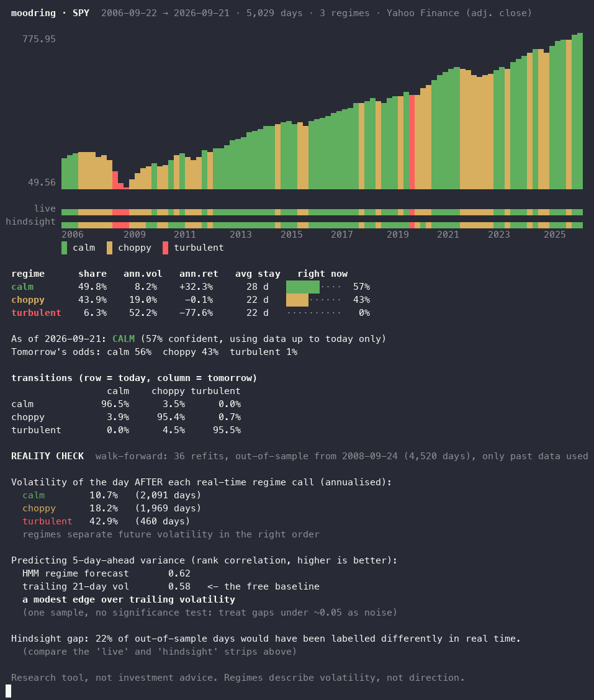

# moodring

A mood ring for the market. It fits a hidden Markov model to any ticker's returns,
paints the price history by volatility regime (calm / choppy / turbulent), and then
does the thing most regime-detection demos skip: it checks, out of sample, whether
those regimes would have helped **in real time**.



One dependency (`numpy`), no API keys, one command:

```bash
moodring SPY
```

## The problem with regime charts

Most HMM regime plots colour each day using *smoothed* probabilities: the model
looks at the whole history, including everything after that day, to decide what
regime it was in. That makes for a beautiful chart and a useless signal, because
on the day you needed the answer, the future wasn't available.

moodring draws both, one above the other:

- **live**: the regime as it was knowable that day (a causal filter, parameters fit only on the past)
- **hindsight**: the regime a smoothed full-sample fit assigns afterwards

The gap between the two strips is the look-ahead you'd be fooling yourself with.

## The reality check

After the report, moodring runs a walk-forward test: fit on a rolling window of the
past, freeze the parameters, filter forward through the next 6 months, repeat. Then
it asks two plain questions using only out-of-sample days:

1. Does the day *after* a "turbulent" call actually have higher volatility than after a "calm" call?
2. Does the regime forecast predict 5-day-ahead variance better than a trailing 21-day
   volatility number, which is free? (Spearman rank correlation.)

It reports the answer whichever way it goes. Results on real data, 20 years of daily
adjusted closes (BTC: 8 years), 3 regimes:

| ticker  | HMM forecast | trailing 21d vol | verdict                  | days relabelled vs hindsight |
|---------|:-----------:|:----------------:|--------------------------|:----------------------------:|
| SPY     | 0.62        | 0.58             | modest edge              | 22% |
| QQQ     | 0.61        | 0.58             | modest edge              | 28% |
| EEM     | 0.52        | 0.53             | wash                     | 34% |
| TLT     | 0.48        | 0.54             | trailing vol is better   | 30% |
| GLD     | 0.44        | 0.50             | trailing vol is better   | 40% |
| BTC-USD | 0.32        | 0.43             | trailing vol is better   | 28% |
| ^VIX    | 0.34        | 0.25             | HMM better               | 39% |

(Run 2026-09-21. Numbers move a little as new data arrives.)

The honest summary: a 3-state HMM is a good *descriptor* of volatility regimes and,
on US equities, a slightly better forecaster than trailing volatility. On bonds, gold
and crypto it isn't. It is not a money machine. If you're building something on
regime signals, this is the bar to clear.

## Install

```bash
pip install git+https://github.com/TheDepressedGuy69/moodring.git
```

Python 3.9+. For development: `pip install -e ".[dev]" && pytest`.

## Usage

```bash
moodring SPY                     # 10 years of daily data from Yahoo Finance
moodring QQQ --years 20          # longer history
moodring BTC-USD --states 2      # 2 regimes (or 3, 4)
moodring --csv prices.csv        # your own data: needs Date and Close/Adj Close columns
moodring --demo                  # synthetic data, works offline
moodring SPY --no-check          # skip the walk-forward test
moodring SPY --width 120 --height 16
```

Colour turns off automatically when piped, or with `--no-color` / `NO_COLOR`.
Annualisation adapts to the data (252 periods/year for equities, 365 for crypto).

## How it works

- **Model:** a Gaussian HMM on daily log returns, fit by EM with a scaled
  forward-backward pass, written from scratch in numpy (`moodring/hmm.py`, about 150
  lines). States are sorted by variance, so "calm" is always the lowest-variance regime.
- **Why not hmmlearn:** its `predict_proba` is smoothed, and this project's whole point is
  the causal filter. The tests assert that filtering a prefix of the data gives
  identical probabilities to filtering the full series, and that the walk-forward
  output for the first N days is bit-for-bit unchanged when later data is appended.
- **Walk-forward:** expanding warm-up of 504 days, rolling 5-year fit window, refit
  every 126 days with warm-started EM (`moodring/walkforward.py`).

## Limits

- Regimes describe **volatility, not direction**. The "ann. ret" column is descriptive.
- There's no significance test on the reality check's rank-correlation gap. We measured
  how often it happens on pure noise with no real regimes: about 1 time in 10 on ordinary
  simulated returns, and up to about 1 time in 4 on fat-tailed noise. Treat one run's
  "edge" verdict as a hint, not proof — it can and does happen by chance.
- Daily close-to-close returns only. Yahoo's free endpoint is unofficial and may
  change; use `--csv` if it breaks.
- This is a research tool. Nothing here is investment advice.

## License

MIT
